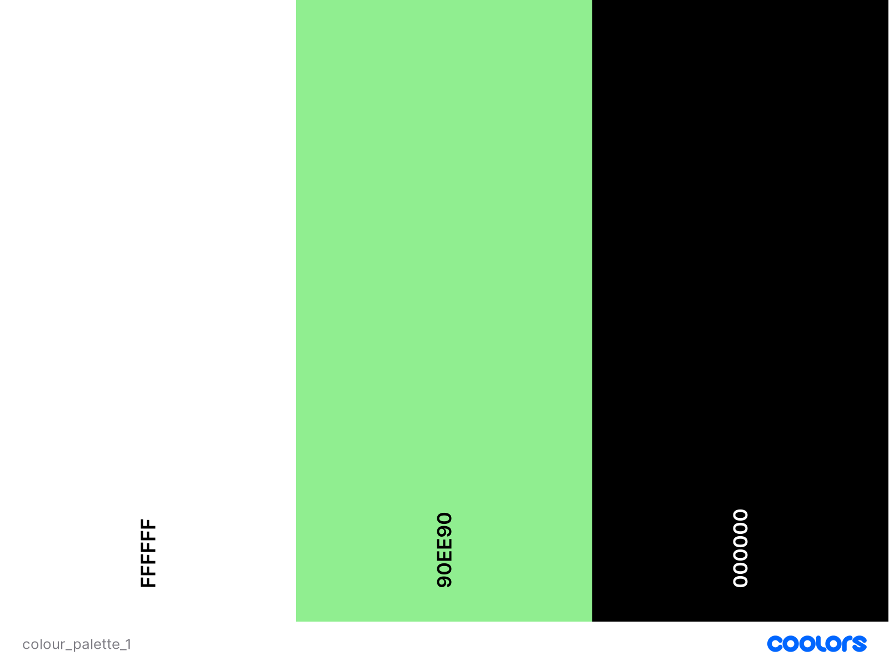
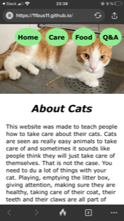
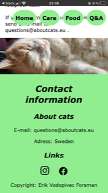
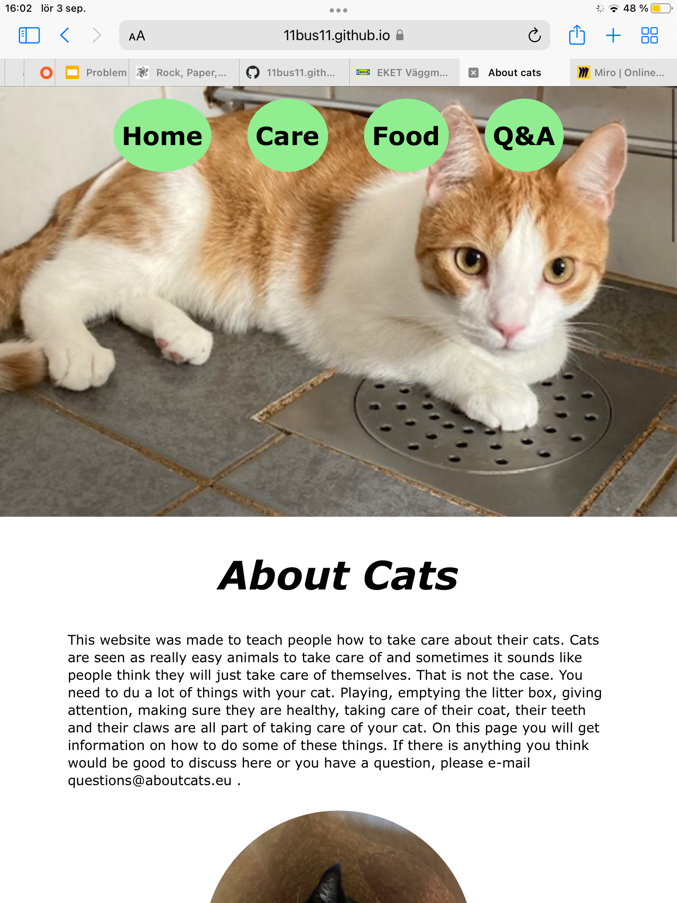
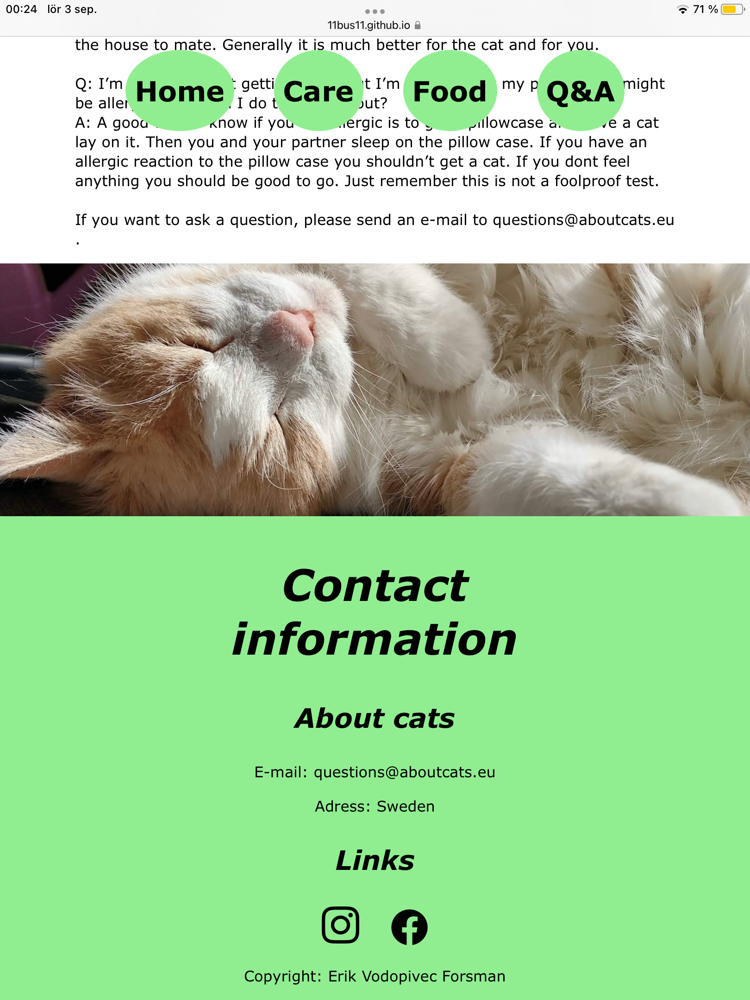
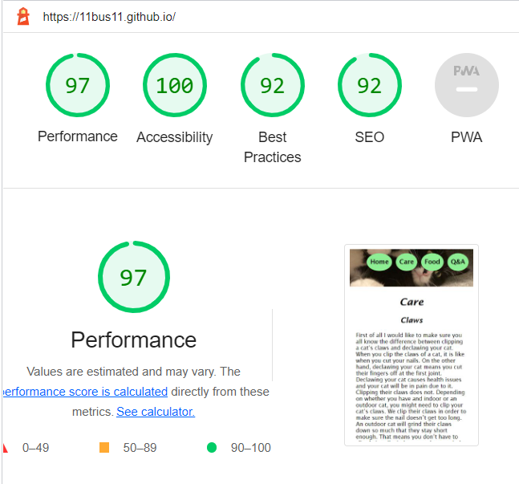

# About cats
When people adopt cats, it can sometimes seem a bit daunting to learn the most important parts in caring for a cat. That’s when “About Cats” comes into the picture. The website is meant to be a source of important information to new and old cat owners. Have you for example adopted a second cat and don’t know how to introduce them to the old cat? Just send in a question or check if the question has already been answered in the Q&A section. Or you might be wondering if you need to clip your outdoor cat’s claw. Then all you need to do is check the Care section of the website. This is a site for all the basic knowledge you need to care for a cat. 

I want to note that the early commits were not very descriptive. My mentor made me aware of the problem, which resulted in me making more descriptive and informative commits. This means that the later commits are of way better quality than the early ones.

## UX (user experience)
My goal with the UX was to create a page that was easy to understand and easy to navigate. I also did not want the colours to be too boring, while still feeling minimalistic. On top of that, I find that rounded pictures and topic images that fill the whole width of the browser window looks nice and modern. It also makes a simple site look more interesting. 

### User stories
I want the user to:
- Be able to figure out what the page is about right away.
- Understand how to navigate the site without any issues.
- Learn about how to take care of their cats.
- Know how to send in a question for the Q&A section. 
- Be able to find "about cats" on social media (note that due to this being a portfolio project, the social media links just links to the instagram and facebook home page. There are no social media accounts for "about cats" for the same reason.)

### Colours
- I chose to have a white background colour in order to make the text easier to read, and because I could focus more on pictures that way. 
- For the navigation bar and the footer I chose to use a light green colour. This adds a "pop of colour" to the website. It also distinguishes them from other parts of the site. 
- In order to avoid the rest of the sections on the website looking too boring, I used the topic images to separate the sections. This makes it more interesting.

### Structure and typography
- Due to only having three topic sections and a home page, I chose to use a navigation bar on both the mobile- and desktop version. 
- I also chose to use one page with different sections instead of multiple separate ones. This was because it worked very well with the amount of content I have. If I had one page for each of the topics, the size of the pages would be a bit small. 
- For the font, I chose Lucida Sans (san serif). This was because I liked the way it looked with the rest of the style choices (not too rigid and not too playful). I used the san serif version because it is easier to read text in san serif on a screen (compared to text with serif). 
- The margin on each side of the text is used to add "white space". The amount of white space varies depending on the size of the screen. This is to make the text space wide enough on smaller screens and avoid making the content hard to read (due to not having enough space for the text). 

## Features

### Navigation bar
- Always visible at the top of the page.
- The different buttons link to different topics on the page.
- The round picture links to the top of the page.

### Topic images
- One image for every topic.
- Separate the sections.
- Background image visible at the top of the page.

### Main section
- Different information about cats.
- Topics separated by images.
- Q&A section.

### Footer
- Contact information.
- Links to social media (opens in new tab).
- Copyright information.

## Features left to implement
- Might want to add a form for sending in questions.
- I want to add more information to the page, since it’s meant to be a page for getting information. If I do this, I might create a hamburger menu (depending on the number of topics).
- A quiz might be interesting to add at some point.

## Testing
Tested all features on many different screen sizes. Also tried it on my phone with no problems. The page looks best on mobile, but looks and works well on every screen size. All features work as intended regardless of screen size and/or device. The navigation is easy to understand on all screen sizes.

### User stories
- Be able to figure out what the page is about right away.
  - When you first land on the page, the background picture (showing an orange cat) and the home page is visible. The title on the home page is "About cats". 
- Understand how to navigate the site without any issues.
  - The header contains a navigation bar with clear topics. And if you do not want to use that, you can still get to the topics by scrolling down.
- Learn about how to take care of their cats.
  - By going to the different topics, you can find information about how to care for cats.
- Know how to send in a question for the Q&A section. 
  - At the bottom of the Q&A section, there are instructions on how to send in questions. An e-mail address is provided.
- Be able to find "about cats" on social media (note that due to this being a portfolio project, the social media links just links to the instagram and facebook home page. There are no social media accounts for "about cats" for the same reason.)
  - In the footer, there are links to social media (shown by the instagram and facebook icons).

### Device testing
The website was tested (manually with Mozilla dev tools) on the following devices:
- iPhone SE (2nd generation)
- iPhone 11 pro
- iPhone 12/13 pro max
- iPad
- Galaxy S10
- Galaxy S20 Ultra
- Galaxy Note 20

The website was tested on these devices:
- Laptop (ACER Aspire 5)
- Desktop (1440p)
- iPhone SE (2nd generation)
 
- iPad
 

The background did show more the smaller the screen gets. I addressed this with my media querries. Depending on the screen size, the top margin for the main page changes. This way the background looks good regardless of screen size.

### Browser testing
The website was tested on these browsers:
- Firefox
- DuckDuckGo (mobile browser)
- Safari
- Microsoft Edge
- Google Crome

No issues related to browsers were found.

### Peer review
Asked a few of my fellow students at Code Institute to take a look at my website. 
- One found it responsive, but would like smaller images (this was before I changed the images). This was solved when I changed the images to smaller ones.
- Another one noted the issue with the off-centre nav bar on mobile (more info in unresolved bugs). He also thought I should consider having a background on the nav.
- A third said the website was very responsive and looked clean. 

### Validator testing
#### Code
- Tested HTML in the W3C validator. Returned no errors.

- Tested CSS in the official Jigsaw validator. Found no errors.

#### Contrast
- Checked the contrast between the background and foreground on [Accessibility Checker](https://www.accessibilitychecker.org/color-contrast-checker/).

- Used Lighthouse to check (among other things) the accessibility.

### Fixed bugs
- I had a problem with getting the footer through the validator without errors. This was because I had chosen to use a span around the footer's content instead of a div. But in the end, I did not use either (since I changed my mind about how I wanted it to look).
- I also had a problem with my media querries. They would not work. This was because I had messed up a meta tag in the header of my HTML. When I fixed the meta tag, the media querries worked as expected and the CSS validator did not show any errors.

### Unfixed bugs
- The "home button" links to the first paragraph, which means that when you click on it, the background picture doesn't show. This has not been adressed yet due to the fact that I haven't decided how i want to address it.

- The nav bar is not properly centred on mobile. I have put the same margin on both the left and right side, but it is not centred. This has not been looked into yet since it does not affect the functionality, and I have not figured out what the problem is yet.

### Deployment
This site was deployed to github pages.
- Open the repository setting on.
- Go to "pages" (found under "code and automation").
- Choose which branch to build from. You want to choose "main". Do not forget to save the settings.
- (If needed, choose a custom domain)
- Open the repository in github desktop (I used github desktop. You can do this in git too.) 
- Choose to create a local clone (the first time you open your repository in github desktop, there should be a window asking if you want to create a clone)
- Copy the link to your deployed website (can be found in the github pages settings, where you chose which branch to build from) and make sure it is operating as expected.
- The deployed website will now be updated when you push anything new to the repository.

[Live website](https://11bus11.github.io/about-cats/)

## Credits
### Content and code
- The code for the CSS grid was taken from one of [my old projects](https://github.com/bus0211/wu2Bprojekt2020). Project from a web development course in secondary school. The reason it is forked from another user (my teacher) is that he wanted to have easy accessto the whole class' projects.
- The icons in the footer were taken from Fontawesome (Link [facebook icon](https://fontawesome.com/search?q=facebook&s=solid%2Cbrands), Link [instagram icon](https://fontawesome.com/icons/instagram?s=brands))

### Media
- All pictures used are either taken by me or a friend (he has given me permission to use the pictures on this website. Name: Robin Koelewijn).
- Robin Koelewijn has taken the topic image for the Q&A, and the image above the footer.

### README
- The readme is inspired by the [readme template](https://github.com/Code-Institute-Solutions/readme-template) provided by Code institute, and a readme written by [Tasha Taylor Johnson](https://github.com/TashaTJ/pawsome-portraits-v4). Tasha's readme was provided to me by my mentor Harry Dhillon.

Erik Vodopivec Forsman, 2022
